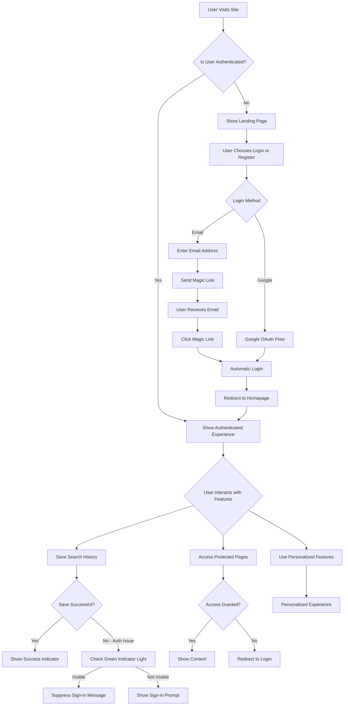

# Authentication User Flow Documentation

## Overview
This document describes the complete user flow for the authentication system, including how users interact with the authentication features and how the system responds to various authentication states.

## User Flow Diagram

## Detailed User Flow Steps

### 1. Initial Site Visit
When a user first visits the site:
- System checks authentication status through middleware
- If authenticated, user proceeds to homepage with full features
- If not authenticated, user is directed to landing page

### 2. Authentication Process
For unauthenticated users:

#### Email Authentication Flow:
1. User selects "Login" or "Register" on landing page
2. User chooses email authentication method
3. User enters email address
4. System sends magic link to user's email
5. User receives email with magic link
6. User clicks magic link
7. System automatically logs user in
8. User is redirected to homepage

#### Google OAuth Flow:
1. User selects "Login" on landing page
2. User chooses Google authentication method
3. User is redirected to Google OAuth
4. User authenticates with Google
5. User is redirected back to site
6. System automatically logs user in
7. User is redirected to homepage

### 3. Authenticated User Experience
Once authenticated, users experience:

#### Green Indicator Light:
- Visible green dot in top-right corner indicates authenticated status
- Hovering shows "You're logged in" tooltip
- Clicking provides logout option

#### Feature Access:
- Full access to personalized features
- Ability to save search history
- Access to protected pages (settings, profile, etc.)
- Personalized content based on user profile

### 4. Search History Saving Flow
When authenticated users perform searches:

1. User enters search query
2. System processes search request
3. System attempts to save search to history
4. If successful:
   - Show success indicator
   - Search appears in history
5. If unsuccessful:
   - System checks for green indicator light
   - If green indicator is visible, suppress sign-in message
   - If green indicator is not visible, show sign-in prompt

### 5. Protected Page Access
When accessing protected pages:

1. User navigates to protected page (e.g., /settings)
2. AuthGuard checks authentication status
3. If authenticated:
   - Page content is displayed
4. If not authenticated:
   - User is redirected to login page

### 6. Session Management
Ongoing session management:

#### Automatic Checks:
- Every 2 minutes, system validates authentication status
- When user returns to tab, session is validated
- On network reconnect, authentication is verified

#### Expiration Handling:
- When session expires, user is notified
- User is prompted to re-authenticate
- Unsaved work is preserved where possible

## Edge Cases and Special Flows

### Network Disconnection:
1. User loses internet connection
2. System detects offline status
3. User continues with limited functionality
4. When connection resumes:
   - Authentication status is revalidated
   - User experience恢复正常

### Token Expiration:
1. Authentication token expires
2. System detects expired token
3. User is notified of session expiration
4. User is prompted to re-authenticate

### Browser Refresh:
1. User refreshes page
2. System revalidates authentication status
3. If still authenticated, user continues seamlessly
4. If not authenticated, user is directed to landing page

## Recent Enhancements

### Suppression of Sign-in Messages:
As implemented in the recent authentication flow changes:

1. System now checks for green indicator light visibility
2. For authenticated users with visible green indicator:
   - Search history saving failures don't show sign-in prompts
   - Persistent authentication reminders are suppressed
3. For unauthenticated users:
   - Appropriate sign-in prompts are shown
   - Progressive reminder intensity based on dismissal history

### Improved Error Handling:
- More descriptive error messages
- Better handling of network timeouts
- Graceful degradation during authentication issues

## User Experience Improvements

### Visual Indicators:
- Clear green indicator for authenticated status
- Loading states during authentication processes
- Success/failure notifications for user actions

### Feedback Mechanisms:
- Toast notifications for authentication events
- Clear error messages for failed actions
- Guidance for next steps when authentication is needed

### Performance Considerations:
- Minimal re-renders during authentication state changes
- Efficient session validation
- Caching of user data where appropriate

## Testing Scenarios

### Authentication Flow Testing:
1. New user registration via email
2. Existing user login via email
3. User login via Google OAuth
4. Session expiration and renewal
5. Network disconnection during authentication
6. Browser refresh while authenticated

### Edge Case Testing:
1. Magic link expiration
2. Concurrent sessions
3. Account switching
4. Password reset flows
5. Multi-device authentication

## Future Enhancements

### Planned Improvements:
1. Biometric authentication integration
2. Multi-factor authentication support
3. Advanced session management
4. Analytics integration for authentication patterns

## Conclusion

The authentication system provides a seamless experience for users while maintaining security and reliability. The recent enhancements ensure that authenticated users with visible green indicators no longer receive unnecessary sign-in prompts, improving the overall user experience while preserving functionality for unauthenticated users who need guidance.